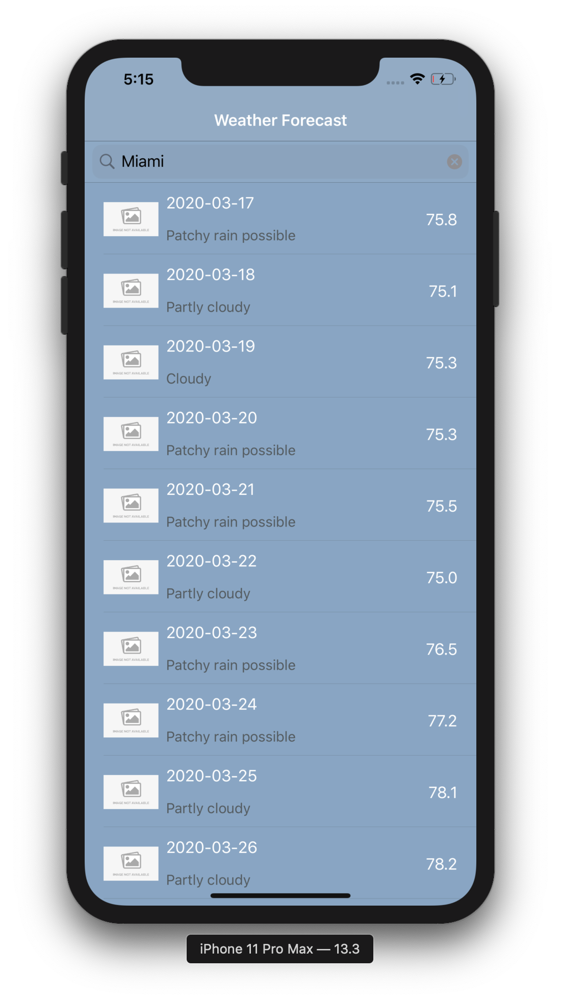

# WeatheriOS

      

## Project Overview

"WeatheriOS" is an iOS project that allows for users to quickly and efficiently search weather forecasts by city. 

### Project development tools

Xcode 11.3.1
Package management tool

[CocoaPods 1.5.3] (https://cocoapods.org/)

### The Code Structure

MVVM

### Key Features

- View 10 day forecasts for given city
